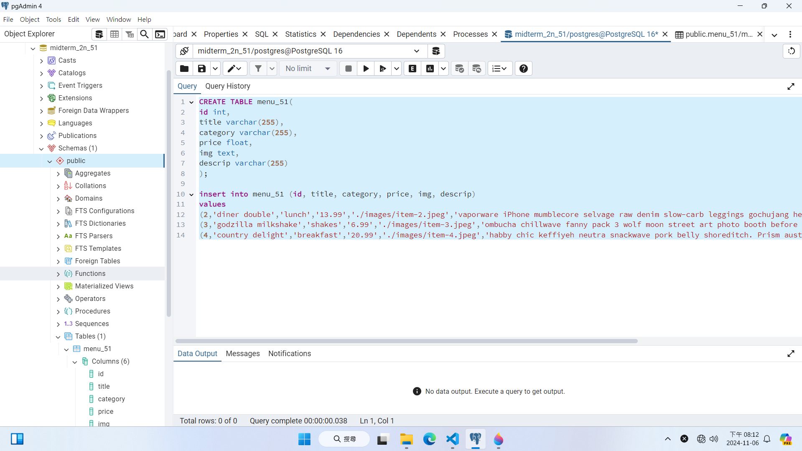
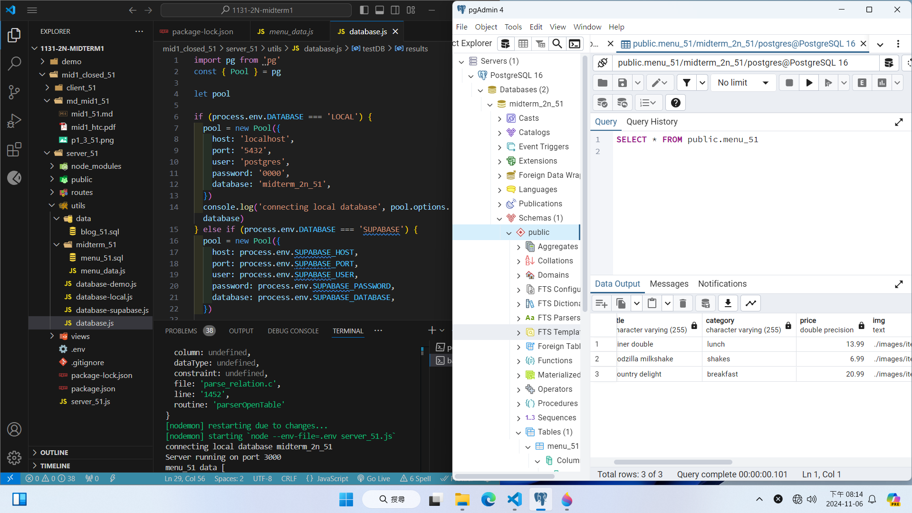
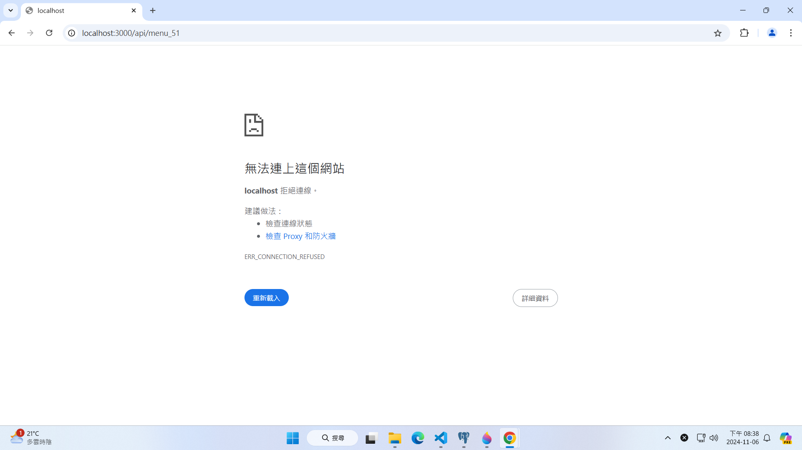
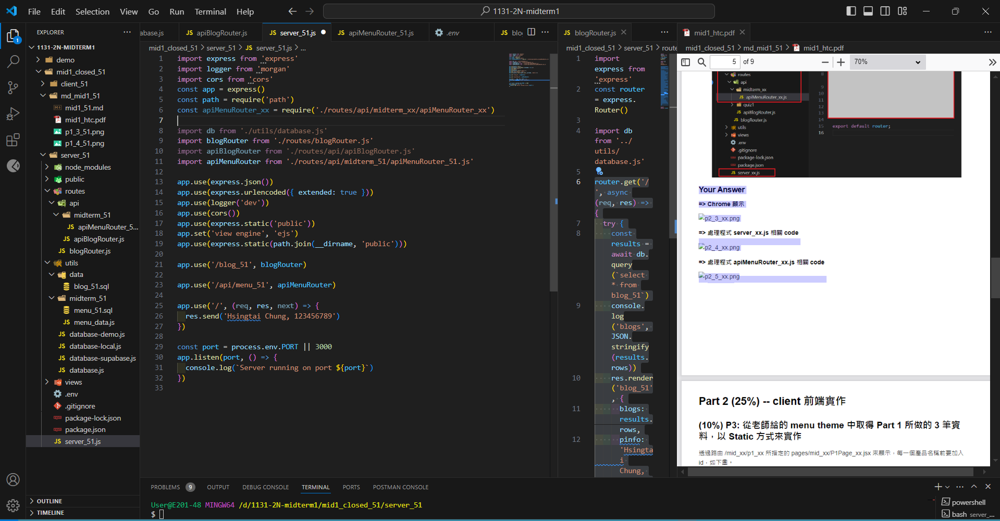
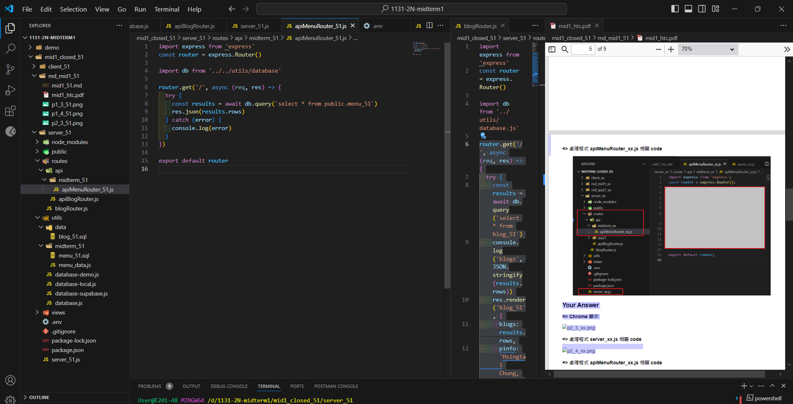

# (50%) Web 程式設計一 期中考 1 -- 斷網考試

##### 2024-11-6, at E201

#### Note:

1. 請不要發揮同學愛，作弊雙方除了本次考試 0 分外，平常分數另扣 20 分，情節嚴重者會送校。
2. iClass 上請繳交 mid1_51.pdf，還有 md_mid1.zip, client_51 (src.zip), server_51.zip 三個壓縮檔，壓縮前請將 node_modules 全部砍掉
3. 請直接將答案寫在 md_mid1_51/mid1_51.md 上，老師出題及圖片放在 mid1_htc.pdf 上，請依照老師所給的圖片來實作並標註
4. 跟小考相關的檔案及目錄名稱有 51 時，必須要改成學號後 2 碼，沒有修改時，會視違犯情況扣分。
5. 每一張圖片要有機房左側背景，圖片上要有你的學號(或後兩碼)，圖片標註要跟老師所標註的類似。違者會依情節扣分。
6. 請自評分數，將每一題的 ? 填入分數，沒有填者，不會批改，以 0 分計算。

##### Your (Name, ID): (張宇晴, 212410251)

##### Part 1 (25%) -- server 後端實作

- P1 (15%): 5 分
- P2 (10%): 0 分

##### Part 2 (25%) -- client 前端實作

- P4 (10%): 0 分
- P5 (15%): 0 分

##### 總分: 5 分

---

## Part 1 (25%) -- server 後端實作

### (15%) P1: 在 pgAdmin 產生的一個 database，名稱為 midterm_2n_51，用 SQL 指令在 pgAdmin 建立一個 product_51 資料表，然後按照下列規則，用 SQL 指令匯入 4 筆資料

請用老師提供的 utils/midterm_51/menu_data.js 中的 json 陣列，根據你的學號最後一碼，比對 id，往下取 3 筆，如果到底，則循環回到第 1 筆繼續往下取。學號最後一碼如為 0，則從第 1 筆往下取 3 筆。

下圖是以學號最後一碼為 7 當成範例。

##### => 顯示 database, table and SQL

記得圖片 7 資料要存入 /mid_51/item-7.jpeg 中，以方面 client 前端存取圖片時的需要，其餘類推

##### => 顯示 database.js 設定，及顯示 3 筆資料

#### Your Answer

##### => 顯示 database, table and SQL

##### => 顯示 database.js 設定，及顯示 3 筆資料

---

### (10%) P2: 透過路由 /api/menu_51，取得 menu_51 資料表內的 3 筆資料，並顯示在 Chrome，處理的程式 apiMenuRouter_51.js 放在 routes/api/midterm_51 目錄下

##### => Chrome 顯示

##### => 處理程式 apiMenuRouter_51.js 相關 code

#### Your Answer

##### => Chrome 顯示

##### => 處理程式 server_51.js 相關 code

##### => 處理程式 apiMenuRouter_51.js 相關 code

---

## Part 2 (25%) -- client 前端實作

### (10%) P3: 從老師給的 menu theme 中取得 Part 1 所做的 3 筆資料，以 Static 方式來實作

透過路由 /mid_51/p1_51 所指定的 pages/mid_51/P1Page_51.jsx 來顯示，每一個產品名稱前要加入 id，如下圖。

圖片已經放入 /public/mid_51 中，請注意圖片檔名為 jpeg

##### => Chrome 顯示

##### => P1Page_51.jsx 重點截圖，最上方請顯示姓名及學號，展開第一個產品內容，其餘產品內容內縮

#### Your Answer

##### => Chrome 顯示如上圖

##### => P1Page_51.jsx 重點截圖，最上方請顯示姓名及學號，展開第一個產品內容，其餘產品內容內縮

---

### (15%) P4: 從 server 取得 menu_51 json 資料，並套用在前端

透過路由 /mid_51/p2_51 所指定的 pages/mid_51/P2Page_51.jsx 來顯示，每一個產品必須透過 <MenuItem_51 /> 元件來顯示，產品名稱前要加入 id，如下圖

##### => Chrome 顯示

##### => 顯示 P2Page_51.jsx & MenuItem_51.jsx 程式重點

#### Your Answer

##### => Chrome 顯示如上

##### => 要顯示是如何從 Node server 抓取資料之程式重點

##### => 要顯示 P2Page_51.jsx & MenuItem_51.jsx 程式重點

